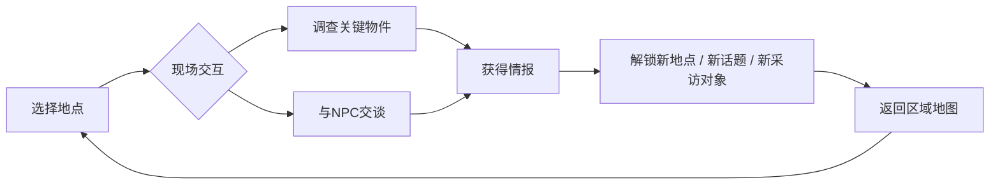

# Street Cat Interview — 游戏设计文档（GDD）

> 把总设计写在这里。具体系统、关卡、角色可拆到子文件夹。

## 一句话卖点


## 核心玩法循环


## 胜利 / 失败条件


## 当前开发范围（优先做什么）

第一章《编外保安大福》Demo 已按计划落地可玩骨架（见 `Assets/Scripts/`）：

1. 剧本流程 SC-01～SC-06 / SC-08  
2. 社区调查与保安交谈  
3. 大福 / 林女士自由采访（规则引擎 + 可选 LLM）  
4. 固定素材卡写稿、沈禾审核、后日谈  

详细设计：`Docs/Chapter1Design.md`  
系统对照：`Docs/systems/README.md`
## 相关文档

- 系统：`Docs/systems/`
- 关卡：`Docs/levels/`
- 角色：`Docs/characters/`


# 《街角专访》游戏策划案


## 设计目的

### 构建以“自由采访”为核心的记者职业体验

当前多数叙事游戏的对话主要通过固定选项推进，玩家可以决定部分对话方向，但实际仍是在策划预设的有限分支中进行选择。本玩法希望以“记者采访”为核心，将“提出问题”本身作为主要操作。玩家不再从固定问题中选择，而是根据已经掌握的情报，自主决定采访对象、采访顺序和具体提问内容。

采访过程中，系统会结合玩家输入内容、已有情报、当前剧情进度和采访对象状态识别玩家的提问意图，并返回符合该角色身份与认知范围的回答。玩家需要持续判断当前已经掌握了哪些信息、还缺少哪些关键内容、下一步应该采访谁，以及当前是否适合继续追问某个敏感话题；对于受访者提供的信息，也需要结合其他人物、场景调查或猫咪视角进行交叉验证。通过该方式，使采访从传统叙事游戏中用于“触发下一段剧情”的对话环节，进一步转化为**需要玩家主动收集信息、选择提问方向和判断信息可信度的核心玩法**。

---

### 通过“人类采访\+猫咪采访”提供多视角叙事

游戏中的采访对象主要分为人类角色和猫咪两类。除救助人、居民、宠物医生等常规采访对象外，玩家还可以使用**杂志社提供的特殊设备【喵语翻译器】**，直接与事件中的猫咪进行交流。该设计一方面用于强化游戏区别于现实记者模拟的奇幻感，为玩家提供“直接采访猫咪本人”的新奇体验；另一方面，也希望通过人类和猫咪不同的认知方式补充同一事件的不同侧面，使采访获得的信息更加完整和客观。

---

### 通过报道结果反馈，强化流浪猫救助主题

本游戏希望玩家在完成采访和报道的过程中，不只是了解某一只猫的个体故事，也能够逐渐接触流浪猫救助背后的现实问题，包括遗弃、疾病救治、绝育、TNR、领养、社区矛盾以及救助资源有限等内容。相比直接通过科普文本向玩家介绍相关知识，本玩法更希望将这些内容放入具体事件和人物选择中，让玩家在调查、采访和写稿过程中自然理解不同救助行为可能带来的结果。

因此，文章发表不会只作为主编评分后的最终结算，而会进一步影响受访者、猫咪和周围环境。玩家在报道中选择强调什么内容、是否公开敏感信息、是否准确区分事实和推测，以及采用怎样的报道立意，都可能带来不同后续。例如，一篇重点介绍待领养猫咪性格和生活状态的报道可能帮助其获得更多领养关注；针对流浪猫繁殖问题的报道可能推动社区了解绝育和TNR；但如果为了提高传播量公开猫咪的具体活动地点，也可能吸引大量陌生人前往围观，反而影响猫咪正常生活。通过这些具体反馈，让玩家理解“关注”和“救助”并不天然等同于正确结果，不同介入方式本身也需要判断。

不同章节可以分别围绕流浪猫救助中的具体问题展开，例如弃养、幼猫救助、伤病治疗、绝育、领养审核、长期投喂和社区TNR等，并通过报道发布后的角色反馈和事件变化呈现相应结果。玩家随着完成越来越多专题报道，也会逐渐积累对流浪动物问题的认识，使游戏在保持故事性和采访玩法的基础上，**引导玩家更加全面地理解流浪猫的生存处境以及科学救助方式**。

---

## 玩法概述

玩家扮演一名动物主题杂志的记者，接受主编布置的专题采访任务，并围绕不同流浪猫事件展开调查与报道。接到任务后，玩家需要先在区域地图中拜访相关地点，与居民、救助者、宠物医生等角色交流，并通过场景调查收集人物、地点和事件情报。随着情报增加，新的采访对象、地点和提问方向会逐步解锁。进入正式采访后，玩家可以自由输入问题，系统会结合当前掌握的情报、采访对象状态和剧情进度判断提问意图，并给出符合角色认知范围的回答。采访对象拥有【信赖】和【耐心】等状态，部分重要信息需要建立足够信赖后才能获得，重复提问、强行追问敏感内容等行为则会消耗耐心，耐心归零后本次采访提前结束。

除人类角色外，部分章节中玩家还可以借助【喵语翻译器】直接采访猫咪，从猫咪的感官、情绪和记忆中获得人类无法提供的信息，并结合不同采访对象的描述进行交叉验证。采访过程中获得的信息会被记录在【记者笔记】中，采访结束后则整理为可用于写稿的【素材卡】。玩家需要在有限版面中筛选素材、确定报道立意并完成文章，随后提交主编审核，根据事实严谨度、采访深度、选材和文章结构等意见进行返稿修改。文章正式发表后，还会根据玩家的报道内容和信息披露方式，对受访者、猫咪和社区产生不同影响，并通过后续反馈呈现结果，形成“**调查收集情报—自由采访—整理素材—撰写报道—审核发布—结果反馈**”的完整玩法循环。

---

## 玩法流程

### 玩法循环

```mermaid
flowchart TD

    %% =========================
    %% 前期调查
    %% =========================
    A[接受主编任务] --> B[查看初始资料与选题目标]
    B --> C[进入区域地图]
    C --> D[探索地点 / 调查场景]
    D --> E[与NPC交流 / 收集基础情报]
    E --> F[获得人物 / 地点 / 事件线索]
    F --> G{是否解锁新的调查方向?}

    G -- 是 --> H[解锁新地点 / 新人物 / 新问题]
    H --> C
    G -- 否 --> I{是否已找到正式采访对象?}

    I -- 否 --> C
    I -- 是 --> J[进入正式采访]

    %% =========================
    %% 中期采访
    %% =========================
    J --> K[自由输入提问]
    K --> L[系统识别问题意图]
    L --> M[根据情报 / 剧情阶段 / 角色认知返回回答]
    M --> N[更新记者笔记]
    N --> O[更新采访对象状态：信赖 / 耐心]

    O --> P{采访是否继续?}

    P -- 是 --> Q{是否解锁更深层信息?}
    P -- 否，耐心耗尽或玩家主动结束 --> X[结束调查与采访]

    Q -- 是 --> R[进入重要事件 / 私人情感 / 敏感话题]
    Q -- 否 --> S[继续普通采访]

    R --> T{是否需要交叉验证?}
    S --> T

    T -- 是 --> U[采访其他人物 / 使用喵语翻译器采访猫咪]
    U --> V[获得补充信息 / 不同视角]
    V --> W{信息是否充分?}

    T -- 否 --> W

    W -- 否 --> K
    W -- 是 --> X

    %% =========================
    %% 后期写稿
    %% =========================
    X --> Y[系统整理采访内容]
    Y --> Z[生成素材卡：事实 / 细节 / 情感 / 推测]
    Z --> AA[玩家筛选有限素材]
    AA --> AB[确定报道立意]
    AB --> AC[生成文章初稿]
    AC --> AD[玩家自行修改]

    AD --> AE[提交主编审核]
    AE --> AF{审核是否通过?}

    %% =========================
    %% 返稿
    %% =========================
    AF -- 否 --> AG[获得返稿意见]
    AG --> AH{问题类型}

    AH -- 结构 / 表达问题 --> AD
    AH -- 事实不充分 --> AI[返回调查 / 补充采访]
    AI --> C
    AH -- 立意或选材问题 --> AA

    %% =========================
    %% 结果反馈
    %% =========================
    AF -- 是 --> AJ[文章正式发布]
    AJ --> AK[触发报道结果反馈]
    AK --> AL[影响受访者 / 猫咪 / 社区 / 救助事件]
    AL --> AM[后日谈 / 读者反馈 / 角色反馈]
    AM --> AN[解锁下一专题或进入章节结算]


    %% =========================
    %% 节点样式定义
    %% =========================

    %% 前期调查：蓝色
    classDef investigation fill:#EAF3FF,stroke:#4A90E2,stroke-width:1.5px,color:#1F3A5F;

    %% 中期采访：橙色
    classDef interview fill:#FFF2E5,stroke:#F28C28,stroke-width:1.5px,color:#6B3A0A;

    %% 判断节点：黄色
    classDef decision fill:#FFF4CC,stroke:#D9A514,stroke-width:2px,color:#5F4700;

    %% 写稿 / 审核：绿色
    classDef writing fill:#EEF8E8,stroke:#68A84F,stroke-width:1.5px,color:#315824;

    %% 结果 / 返稿：紫色
    classDef result fill:#F1EBFA,stroke:#8A63C7,stroke-width:1.5px,color:#4E3475;

    %% 返回调查：浅蓝
    classDef returnNode fill:#E8F6FA,stroke:#4B9EBA,stroke-width:1.5px,color:#285C6C;


    %% =========================
    %% 应用样式
    %% =========================

    %% 前期调查节点
    class A,B,C,D,E,F,H investigation;

    %% 采访节点
    class J,K,L,M,N,O,R,S,U,V interview;

    %% 判断节点
    class G,I,P,Q,T,W,AF,AH decision;

    %% 写稿节点
    class Y,Z,AA,AB,AC,AD,AE writing;

    %% 返稿 / 结果节点
    class X,AG,AJ,AK,AL,AM,AN result;

    %% 返回调查节点
    class AI returnNode;
```




---

## 核心系统与模块设计

### 调查与地图探索系统

#### 系统概述

调查与地图探索主要承担正式采访前的前置信息收集功能。玩家接受主编布置的专题任务后，初始只会获得少量基础资料，例如事件概要、目标猫咪照片或最初联系人等，不会直接获得完整的采访对象名单和事件经过。

玩家需要进入本次专题对应的区域地图，通过拜访不同地点、调查场景和与NPC交谈，逐步了解事件背景，并获得与人物、地点和事件相关的【情报】。部分情报会进一步解锁新的调查地点、交谈话题或正式采访对象，从而推动调查继续进行。

由于本游戏的核心体验仍然集中在正式采访环节，地图探索采用轻量化设计，不强调自由移动或复杂场景解谜。每个专题对应一个独立的区域地图，地图由若干地点节点组成，例如社区、便利店、宠物医院、救助站、公园、居民楼等。玩家选择地点后直接进入对应调查场景，并通过【调查】和【交谈】两种主要方式获取信息。

调查阶段的核心作用是帮助玩家完成两件事：

- 找到本次专题中值得正式采访的人；

- 在采访前掌握一定背景信息，为后续自由提问提供依据。

系统的整体流程循环：




---

#### 区域地图与地点

每个专题配置若干与事件相关的调查地点。

部分地点会在任务开始时直接开放，例如事件发生地点或主编已经提供的信息中明确提到的位置；其他地点则需要**通过调查获得相关情报后逐步解锁**。

---

#### 调查环节

【调查】主要用于查看场景中与当前事件有关的物件或资料。

玩家进入地图的某个地点后，可以查看场景中具有调查价值的物件，例如：

- 猫碗、猫窝等与猫咪生活相关的物品；

- 照片、留言、公告等文字信息；

- 医疗记录、救助记录等事件资料；

- 与当前事件有关的环境痕迹。

选择调查对象后，系统显示对应的调查文本，并在必要时获得新的【情报】。

例如：

玩家调查社区楼下的猫碗：

> 碗里的猫粮还很新，旁边放着一瓶开封的矿泉水，看起来有人定期来这里投喂。
> 
> 

获得情报：

【固定投喂点】

---

#### 交谈环节

场景中存在可交互NPC时，玩家可以与其进行简单交谈。

调查阶段的NPC对话主要用于获取线索，不进入完整的自由采访模式。玩家可以从少量话题中选择希望了解的内容，例如：

- 关于这只猫；

- 最近发生的事情；

- 附近是否有人照顾它。

随着玩家获得新的情报，部分NPC可能增加新的交谈话题。

---

#### 情报与调查推进

当玩家通过调查找到至少一名与本次专题核心事件相关的正式采访对象后，即可进入正式采访阶段。

**游戏不要求玩家完成所有调查内容后才能继续推进**。部分地点和线索属于可选内容，玩家可以在获得基本信息后直接开始采访，也可以继续调查，以掌握更多背景信息。

提前完成更多调查可以：

- 获得额外采访对象；

- 提前掌握关键事件背景；

- 解锁更具体的采访方向；

- 减少正式采访阶段用于确认基础信息的时间。

但调查不足也不会直接阻断流程。玩家仍然可以进入采访，只是可能需要通过更加基础的问题逐步了解事件，部分隐藏信息也可能因为缺少前置情报而更难发现。

正式采访过程中，如果玩家发现某项信息需要其他人物或资料进行验证，也可以重新返回区域地图继续调查。

因此，调查与正式采访之间形成双向关系：**调查为采访提供信息基础，采访中产生的新问题又可能推动玩家重新调查。**

---

### 采访系统

#### 系统概述

采访是本游戏的核心玩法模块。玩家在前期调查阶段获得一定背景信息，并解锁正式采访对象后，可以进入采访界面，与对应人物或猫咪展开完整采访。与调查阶段中以固定话题为主的普通交谈不同，正式采访允许玩家自由输入问题，并根据自身已经掌握的信息自主决定采访方向、追问顺序和深入程度。

采访过程中，系统不会按照固定对话树依次播放内容，而是根据玩家当前输入的问题，结合已获得情报、采访对象认知范围、当前剧情进度以及采访对象状态，判断玩家想了解的具体内容，并返回对应回答。玩家可以围绕同一个事件从不同角度进行追问，也可以暂时跳过某一部分内容，转向其他主题。最终能够获得多少信息，以及哪些深层内容能够被解锁，会受到玩家提问方式和采访顺序的共同影响。

---

#### 采访流程

玩家与已解锁的正式采访对象交互后进入采访界面。界面中主要展示采访对象、历史对话内容、自由输入框、记者笔记以及采访对象当前的状态数值。

玩家输入问题并提交后，系统首先判断该问题对应的采访意图，再根据当前状态返回回答。回答结束后，系统会根据本次对话结果更新记者笔记、采访对象状态以及相关剧情进度。如果本次回答中包含新的关键内容，则对应信息会被记录，并可能进一步解锁新的采访方向。

因此，一次完整采访的基础循环为：

```mermaid
flowchart LR
    A[输入问题] --> B[判断提问意图]
    B --> C[返回采访回答]
    C --> D[获得信息]
    D --> E[更新记者笔记与人物状态]
    E --> F[决定下一次提问]
    F --> A```

玩家可以持续进行上述循环，直到主动结束采访，或采访对象因耐心耗尽等原因提前终止本次采访。

---

#### 自由提问与问题识别

正式采访允许玩家直接在输入框中输入希望询问的内容。系统需要支持同一采访意图的多种自然语言表达，避免玩家必须使用指定句式才能推进内容。

例如，以下问题：

> “您和黄泥巴是什么关系？”
> 
> “黄泥巴对您来说算什么？”
> 
> “你们以前感情怎么样？”
> 
> 

虽然文字表达不同，但都可以被识别为【与黄泥巴的关系】这一采访意图。

问题识别除了参考关键词外，还需要结合当前对话上下文进行判断。例如，在采访对象刚刚提到“后来有一天，它没有像平时一样回来”的情况下，玩家输入：

> “后来呢？”
> 
> 

系统应优先理解为继续追问当前事件，而不是将其识别为新的无关问题。

同时，部分问题只有在玩家提前获得相关情报后，才能得到更加具体的回答。例如玩家已经在调查阶段了解到猫咪曾接受过一次外伤治疗，再询问采访对象：

> “我了解到它之前曾经去医院处理过外伤，当时发生了什么？”
> 
> 

则可以直接进入对应事件；如果玩家此前没有掌握这项信息，则只能通过更加宽泛的问题逐步了解。

通过该方式，使前期调查获得的情报能够真正影响后续采访效率和提问深度。

---

#### 回答范围与角色认知

每个采访对象拥有独立的信息范围。系统只能基于该角色实际知道、记得或认为发生过的事情进行回答，不能因为玩家询问了某个内容，就直接提供完整客观答案。

例如，采访尤女士时，她可以回答自己小时候与黄泥巴相处的经历、事故发生后看到的情况以及自己当时的感受，但对于黄泥巴掉入石灰池的具体过程，她并没有亲眼看到，因此只能表达：

> “我后来猜，它可能是掉进附近工地的石灰池了。”
> 
> 

该内容在系统中应被记录为【推测】，而不是确认事实。

同样，当玩家询问角色并不知道的信息时，采访对象可以直接表示“不知道”“没有注意过”或“已经记不清了”。游戏不要求每一个玩家问题都必须产生新的有效信息。

这一规则主要用于保证不同采访对象之间的信息边界，并为后续的交叉验证和素材分类提供基础。

#### 信息分层与剧情卡点

重要采访内容不会因为玩家输入一个宽泛问题就一次性全部释出，而是按照事件本身的叙事结构拆分为多个信息节点。

以黄泥巴事故相关内容为例，玩家最初只能了解黄泥巴的日常生活、翻窗习惯、冬夜陪伴等内容。当玩家进一步询问“为什么这么多年还一直记得它”时，尤女士可能只会提到：

> “后来发生过一件事，我到现在都忘不了。”
> 
> 

此时系统只解锁【存在一段重要回忆】，不会直接进入事故全部经过。

玩家继续追问后，才依次获得：

【那天晚上黄泥巴没有出现】

↓

【后来听见门口传来挠门声】

↓

【开门后发现黄泥巴严重受伤】

↓

【家人推测可能掉入石灰池】

↓

【尝试清洗和取暖】

↓

【当晚仍在发抖】

↓

【第二天去世】

通过这种分段释放方式，使玩家必须通过持续追问逐渐还原事件，同时避免采访对象在缺乏铺垫的情况下主动讲出完整剧情。

部分信息节点还可以设置额外条件，例如需要达到指定信赖值、掌握某项前置情报，或者已经完成某个相关话题后才能继续深入。

#### 追问与承接

采访系统鼓励玩家根据采访对象刚刚提供的信息进行承接式追问。

例如，采访对象回答：

> “黄泥巴每天晚上都会从窗户跳进来。”
> 
> 

玩家可以继续询问：

> “它每天都会来吗？”
> 
> “下雨的时候也会来吗？”
> 
> “家里其他人知道这件事吗？”
> 
> 

这些问题分别可以继续解锁时间频率、生活细节和家庭关系相关信息。

相比完全跳跃式地询问大量无关问题，承接当前话题进行深入提问能够更容易获得完整信息，也可以对采访对象的信赖产生正向影响。

#### 重复提问与无效问题

为了避免玩家通过不断尝试问题穷举所有内容，系统需要对重复提问和明显无关问题进行处理。

如果玩家再次询问已经完整回答过的问题，采访对象不会重复播放整段相同回答，而是根据情况进行简短回应，例如：

> “这个刚才已经说过了。”
> 
> 

或者补充少量此前未提及的细节。

**连续重复询问相同内容会额外消耗采访对象耐心。**

对于与当前专题明显无关的问题，采访对象可以进行正常的拒绝或简单回应，不产生有效采访信息。例如：

> “这个和今天要采访的事情应该没有什么关系吧？”
> 
> 

少量无关问题不会立即造成严重惩罚，但如果玩家持续偏离采访主题，则会降低采访效率并消耗耐心。

#### 敏感问题

涉及死亡、遗弃、家庭矛盾、后悔、自责等内容时，系统将其视为敏感采访话题。

敏感问题并非不能询问，但需要玩家在合适的采访阶段提出。若玩家在刚进入采访时就直接询问：

> “它最后是怎么死的？”
> 
> 

即使该内容属于当前专题，采访对象也可能因为尚未建立足够信赖而拒绝详细回答。

例如：

> “后来确实发生过一些事情，不过这个我现在不是很想直接说。”
> 
> 

玩家可以先从日常生活、关系和相关背景进行采访，逐渐提高信赖，再重新进入敏感话题。

如果采访对象已经明确表示暂时不愿回答，而玩家仍然连续追问相同内容，则会降低信赖并消耗更多耐心。

通过该规则，使“能不能得到答案”不仅取决于玩家是否想到了正确问题，也取决于玩家选择在什么时机提出这个问题。

#### 新信息获取与记者笔记更新

玩家通过采访获得新的有效信息后，对应内容会自动加入采访记录，并同步更新【记者笔记】。

记者笔记不会完整记录采访对象所有原话，而是提炼为简短的信息方向。例如：

采访回答：

> “冬天家里没有暖气，它晚上会钻进我的被子，有时候就趴在我肚子上睡，呼噜声特别响。”
> 
> 

记者笔记更新：

【冬夜陪伴】

已获得：

- 冬天黄泥巴会进入房间陪睡；

- 会趴在尤女士身边取暖。

部分重要回答还可能解锁新的笔记主题。

例如，当尤女士第一次提到：

> “后来发生过一件我一直忘不了的事情。”
> 
> 

记者笔记新增：

【后来发生的事】

但不会提前显示事故具体内容。

玩家可以通过记者笔记判断当前已经了解了哪些内容，以及哪些方向仍值得继续采访。

#### 采访结束

玩家可以在任意阶段主动选择【结束采访】。

如果当前仍存在较多未获取的重要信息，系统可以进行一次轻度提醒：

> “当前仍有部分采访方向尚未深入，是否结束本次采访？”
> 
> 

玩家仍然可以确认结束。

**若采访对象耐心归零，则本次采访会直接结束，不允许继续提问。**

无论是主动结束还是被采访对象提前终止，玩家已经获得的信息都会保留，不要求必须完整采访所有内容才能继续游戏。

采访结束后，系统根据玩家实际获取的信息生成对应的采访记录与素材，并进入后续整理阶段。未采访到的内容不会自动补全，也不会出现在后续可选择素材中。

因此，采访结果将直接决定玩家最终可以使用哪些信息完成报道，并进一步影响文章质量、主编审核以及报道发布后的结果。

### 记者笔记系统

#### 系统概述

【记者笔记】用于记录玩家在调查和采访过程中已经获得的信息，并辅助玩家判断当前还有哪些内容值得继续了解。

由于正式采访采用自由输入形式，玩家不会像传统选项式对话一样直接看到所有可选问题，因此需要一套轻量化的信息提示机制，帮助玩家回顾已有线索，并避免在采访过程中因为遗漏前文而不知道下一步应该问什么。

记者笔记不会直接给出完整答案，也不会提前显示尚未触发的重要剧情内容，而是将当前专题拆分为若干【采访主题】，并根据玩家实际获取的信息动态更新主题名称、完成状态和提示内容。

玩家可以通过记者笔记快速确认：

- 当前已经了解了哪些内容；

- 哪些内容只获得了初步线索；

- 哪些方向仍然可以继续深入；

- 最近获得的新信息可能与哪些采访主题有关。

记者笔记的作用主要是降低自由输入玩法的理解门槛，但不会替代玩家自身的提问和判断。

---

#### 采访主题

每个专题会根据核心故事内容配置若干【采访主题】。采访主题用于概括一组相关信息，而不是直接提供具体问题。

例如【黄泥巴】章节可以包含：

- 黄泥巴是谁；

- 童年生活环境；

- 翻窗的秘密；

- 冬夜陪伴；

- 生活趣事；

- 一段重要的回忆；

- 最后一晚；

- 多年后的意义

- \.\.\.

玩家不需要按照固定顺序依次完成所有主题。一个问题也可能同时推进多个主题，例如询问“您觉得黄泥巴和您是什么样的关系”，既可能补充【黄泥巴是谁】，也可能涉及【多年后的意义】。

因此，采访主题主要用于表现当前信息覆盖情况，而不是作为线性任务列表。

---

#### 主题状态

每个采访主题根据玩家当前掌握的信息显示不同状态。

**○ 尚未触及**

当前尚未获得该方向的有效信息。

例如：

> ○ 冬夜陪伴
> 尚未触及
> 
> 

**◐ 已有线索**

玩家已经获得部分相关内容，但仍存在明显可以继续深入的信息。

例如：

> ◐ 冬夜陪伴
> 已知：黄泥巴冬天会进入房间陪睡。
> 
> 

**● 已深入**

玩家已经获得该主题下的主要信息，可以认为当前内容已经足够支撑后续报道。

例如：

> ● 冬夜陪伴
> 已了解到黄泥巴冬夜进入房间、陪睡方式以及这段陪伴对尤女士的意义。
> 
> 

达到【已深入】后仍然可以继续提问，但系统不再将其视为当前优先补充的方向。

---

#### 信息记录

玩家在调查或采访过程中获得有效信息后，系统会将其整理为简短内容，记录在对应采访主题下。

例如玩家询问：

> “黄泥巴为什么叫这个名字？”
> 
> 

获得回答后，记者笔记记录：

【黄泥巴是谁】

- 毛色像过去腌咸鸭蛋时使用的黄色泥巴，因此被叫作“黄泥巴”。

玩家进一步询问翻窗相关内容后：

【翻窗的秘密】

- 黄泥巴晚上会从窗户进入尤女士的房间；

- 早上会在家人发现之前离开；

- 这是两者之间长期保持的小秘密。

记者笔记只提炼采访信息，不完整保存原始回答。完整对话仍可在采访记录中查看。

---

#### 提问灵感

当玩家不知道下一步可以继续询问什么时，可以点击记者笔记中的采访主题，获得对应的【提问提示】。

提问提示采用自然的采访问题，只提供方向，不直接透露隐藏内容。

例如：

点击【生活趣事】：

> “和黄泥巴还有什么有趣的事情可以分享吗？”
> 
> 

点击【家人的反应】：

> “当时您的家人知道这些事情吗？”
> 
> 

点击提示后，问题会自动填入采访输入框，但不会直接发送，玩家可以继续修改后再提交。

提问提示只根据玩家当前已经解锁的信息生成。尚未触发的重要剧情不会提前出现对应问题，避免通过记者笔记直接暴露后续内容。

---

#### 与调查系统联动

调查阶段获得的部分情报会同步进入记者笔记，并影响后续正式采访中的提问方向。

例如玩家在宠物医院提前获得：

【目标猫曾接受过外伤治疗】

进入正式采访后，记者笔记可以新增：

> ○ 以前的伤
> 
> 

玩家可以直接围绕该信息进行追问。

如果玩家没有提前完成对应调查，则这一方向不会主动出现在记者笔记中，需要通过采访对象本身的回答逐步发现。

因此，记者笔记同时承担调查和采访之间的信息衔接作用，使前期调查获得的情报能够直接转化为后续自由采访中的提问依据。

---

### 素材卡系统

#### 系统概述

【素材卡】用于将玩家在调查和采访过程中实际获得的信息整理为可用于写稿的报道素材，是采访阶段与文章撰写阶段之间的主要衔接系统。

玩家结束采访后，系统不会直接根据完整剧情生成文章，而是根据玩家已经确认的信息生成对应素材卡。未通过调查或采访获得的内容不会自动补充，也不会出现在素材列表中。

因此，不同玩家即使面对同一个专题，也可能因为调查路线、采访对象和提问方向不同，最终获得不同的素材集合。前期采访决定玩家“手里有哪些材料”，后续素材选择则决定玩家“准备讲一个什么样的故事”。

---

#### 素材卡生成

当玩家在调查或采访过程中获得具有报道价值的信息后，该信息会先记录至记者笔记。正式结束调查与采访阶段后，系统根据当前已经获得的有效信息统一生成素材卡。

并非每一句采访回答都会生成独立素材卡。系统需要对同一主题下高度重复的信息进行整理和归纳，只保留具有明确报道价值的内容，避免素材数量过多导致后续选择压力。

例如，玩家围绕黄泥巴翻窗进行了多次追问，分别了解到：

- 黄泥巴每天晚上会从窗户进入房间；

- 早上会在外婆发现之前离开；

- 外婆一直不知道这件事。

系统可以整理为一张素材卡：

【翻窗的秘密】

> 黄泥巴每天晚上都会从窗户进入尤女士的房间，并在早上家人发现之前离开。这件事长期只有尤女士和黄泥巴知道。
> 
> 

若玩家只问到“黄泥巴晚上会从窗户进来”，则生成的素材内容也只包含已经确认的部分，不会自动补充后续细节。

---

#### 素材类型

根据内容性质，素材卡主要分为【事实】【细节】【情感】【推测】四类。

**事实素材**

记录能够由当前调查或采访确认的信息，主要用于构成报道的基础事件。

例如：

【秘密养猫】

> 外婆不允许将猫养进屋内，黄泥巴平时主要在屋外活动。
> 
> 

**细节素材**

记录能够增强文章具体感和画面感的生活细节。

例如：

【冬夜陪伴】

> 冬天没有暖气时，黄泥巴会钻进房间，趴在尤女士身边睡觉，有时还会把爪子搭在她肚子上。
> 
> 

细节素材通常不是推进事件所必需的信息，但能够帮助玩家写出更具体的人物和猫咪形象。

**情感素材**

记录采访对象明确表达过的感受、态度或回忆。

例如：

【不知道还能做什么】

> 尤女士回忆，当时最强烈的感受并不是害怕，而是无助和迷茫，因为不知道自己还能怎样救它。
> 
> 

情感素材主要用于支撑人物关系和报道立意。

**推测素材**

记录无法直接确认、主要来自人物判断的信息。

例如：

【可能掉进石灰池】

> 尤女士和家人根据黄泥巴当时的状态推测，它可能掉进了附近工地的石灰池。
> 
> 

推测素材可以用于文章，但需要保留“不确定”的表达方式，不能直接改写为确定事实。

---

#### 素材筛选

进入写稿阶段后，玩家可以查看本次调查获得的全部素材，并从中选择希望用于报道的内容。

文章存在有限的素材容量，玩家无法将所有获得的信息全部放入同一篇文章，需要根据自己的报道方向进行取舍。

例如一篇文章可以限制选择8～10张主要素材。

若玩家希望将文章重点放在【童年的秘密伙伴】，可能优先选择：

- 名字由来；

- 外婆不允许养猫；

- 翻窗的秘密；

- 冬夜陪伴；

- 生活趣事。

而如果玩家希望重点表现【最后一次回家】，则会更多选择：

- 那晚没有出现；

- 门外挠门；

- 受伤状态；

- 救助过程；

- 最后一晚；

- 多年后的遗憾。

通过素材数量限制，使玩家不能简单地将采访获得的所有内容依次写入文章，而需要主动判断哪些内容真正服务于自己的报道立意。

---

#### 素材排序

玩家选择素材后，可以调整素材在写稿区中的顺序。

素材顺序主要用于表达玩家希望采用的大致文章结构，并作为初稿生成的重要参考。

例如：

【名字由来】

↓

【外婆不允许养猫】

↓

【翻窗的秘密】

↓

【冬夜陪伴】

↓

【那晚没有出现】

↓

【最后一晚】

对应较为自然的时间顺序叙事。

玩家也可以选择：

【最后一晚】

↓

【翻窗的秘密】

↓

【冬夜陪伴】

↓

【多年后的意义】

形成先从核心事件切入，再回到过去补充关系背景的结构。

因此，素材卡不仅决定“文章写什么”，也可以初步决定“文章按什么顺序讲”。

---

#### 与报道立意的联动

玩家完成素材选择后，需要确定本篇报道的主要立意。

系统会结合当前已经选择的素材，判断其是否能够支撑对应立意。

例如：

玩家选择：

【翻窗的秘密】

【冬夜陪伴】

【生活趣事】

【多年后的意义】

更适合主题：

【童年的秘密伙伴】

而如果玩家选择：

【受伤归来】

【没有宠物医院】

【当晚的救助】

【成年后的遗憾】

则更适合：

【一个孩子无法救下的猫】

玩家仍然可以自由选择其他立意，但如果所选素材与文章主题明显不匹配，会在后续主编审核中的【立意集中度】和【素材运用】上受到影响。

---

### 文章写作系统

#### 系统概述

【文章写作系统】用于将玩家前期调查、采访和素材筛选的结果转化为最终报道。玩家完成素材选择后，需要确定本篇文章的报道立意，并根据选中的素材组织文章结构，在系统辅助下完成初稿和后续修改。

本系统不希望将写作阶段设计成完全自由的长文本创作。一方面，要求玩家从零撰写完整报道的操作成本较高，也容易使玩法重点从“采访与信息判断”偏移到单纯的文字写作，增加玩家的负担和压力；另一方面，如果系统在采访结束后直接自动生成完整文章，又会削弱玩家在选材和表达上的参与感。

因此，写作阶段采用“**玩家决定内容与方向，系统辅助完成表达**”的形式。玩家主要负责选择素材、确定立意、调整内容顺序和修改关键表达，系统负责根据这些信息生成文章。最终文章的内容仍然受到玩家实际采访结果限制。

---

#### 写作流程

玩家完成素材筛选后进入写作界面。

基础流程为：

```mermaid
flowchart LR
    A[选择报道立意] --> B[调整素材顺序]
    B --> C[生成文章初稿]
    C --> D[玩家阅读并修改]
    D --> E[确认标题与正文]
    E --> F[提交主编审核]```

写作界面主要包含：

- 当前报道立意；

- 已选择素材；

- 素材排列顺序；

- 文章标题；

- 文章正文；

- 修改辅助功能；

- 提交审核入口。

玩家可以在生成初稿后继续调整文章，不需要一次完成全部内容。

---

#### 报道立意

【报道立意】用于确定本篇文章重点希望表达什么，也是系统组织素材和生成文章结构的重要依据。

同一组采访内容可以根据选材和立意形成不同报道。

例如【黄泥巴】专题中，可以存在以下方向：

**童年的秘密伙伴**

重点表现黄泥巴与尤女士之间长期、隐秘的陪伴关系，主要使用翻窗、冬夜陪伴和生活趣事等素材。

**最后一次回家**

以黄泥巴受伤归来作为主要事件，重点表现人与动物之间的关系以及最后一晚的经历。

玩家选择立意后，系统不会限制其只能使用指定素材，但会将该立意作为后续文章生成和主编审核的重要参考。

如果玩家选择的素材与立意明显不匹配，例如选择【童年的秘密伙伴】，但文章几乎全部使用事故和死亡相关素材，则最终文章可能出现主题不集中等问题。

---

#### 素材顺序与文章结构

玩家完成立意选择后，可以继续调整已选素材的排列顺序。

素材顺序用于表示玩家希望文章按照怎样的逻辑展开，系统生成初稿时优先参考这一顺序组织正文。

例如按照时间顺序排列：

【名字由来】

↓

【翻窗的秘密】

↓

【冬夜陪伴】

↓

【那晚没有出现】

↓

【受伤归来】

↓

【最后一晚】

↓

【多年后的意义】

可以形成较为完整的顺叙结构。

玩家也可以将【受伤归来】放在文章开头，再回到童年时期补充两者关系，从而形成倒叙结构。

系统不会要求玩家使用固定文章模板，但需要保证选中的主要素材在正文中得到合理使用，避免玩家选择大量素材后实际文章只使用其中少数内容。

---

#### 初稿生成

玩家确认报道立意和素材顺序后，可以选择【生成初稿】。

系统根据以下内容生成文章：

- 玩家选择的报道立意；

- 当前使用的素材卡；

- 素材排列顺序；

- 素材对应的信息性质；

- 当前专题的基础写作规范。

生成内容包括：

- 文章标题；

- 完整正文。

初稿主要帮助玩家完成信息组织和基础文字表达，不代表最终文章。玩家仍需要阅读文章，并判断其中的结构、表达和事实边界是否符合自己的报道意图。

系统生成文章时只能使用玩家已经选择的素材及其中明确包含的信息，不得主动调用章节中尚未被玩家发现的剧情内容。

例如玩家没有采访到尤女士成年后的遗憾，则初稿中不能因为该内容属于完整故事的一部分而自动补充。

通过该规则，使最终文章始终能够追溯到玩家实际完成的调查和采访过程。

---

#### 自由修改

初稿生成后，玩家可以直接修改文章标题和正文。

正文采用可编辑文本形式，玩家可以：

- 删除不希望使用的内容；

- 调整句子表达；

- 增加段落衔接；

- 修改文章结构；

- 调整标题；

- 改变文章重点。

玩家修改后不会改变原始素材本身，只改变最终报道的表达方式。

例如原素材为：

> 尤女士认为，黄泥巴最后可能是想回到一个熟悉、安全的地方。
> 
> 

玩家可以修改为：

> 尤女士至今仍愿意相信，黄泥巴最后选择回到了自己熟悉的地方。
> 
> 

该表达仍然保留“受访者认为”的事实边界。

但如果玩家修改为：

> 黄泥巴拼尽最后的力气，只为了回家再见她一面。
> 
> 

则已经将采访对象的主观推测改写为了确定事实，后续主编审核会将其识别为事实严谨性问题。

---

#### 事实边界

文章写作阶段允许玩家改变表达，但不允许系统自动改变信息的事实性质。

素材中的【事实】【推测】【受访者观点】【情感表达】在进入文章后仍然保留对应边界。

例如：

素材：

【推测】

> 尤女士和家人认为，黄泥巴可能掉进了附近工地的石灰池。
> 
> 

文章可以写为：

> 家人后来根据它满身的石灰推测，它可能曾掉进附近工地的石灰池。
> 
> 

但不能在系统自动生成时写为：

> 黄泥巴掉进了附近工地的石灰池。
> 
> 

同样，猫咪通过喵语翻译器提供的感官描述，也不能未经验证直接被系统转换为人类视角下的客观事件。

该规则用于保证采访、素材整理和文章写作之间的信息一致性，并为后续主编审核提供明确依据。

---

#### 写作完成

玩家完成标题和正文修改后，可以选择【提交主编审核】。

提交前系统不要求文章达到唯一的标准结构，只需要满足基础条件，例如：

- 已确定报道立意；

- 已选择最低数量的有效素材；

- 正文达到基础篇幅要求；

- 文章标题不为空。

满足条件后即可提交。

文章进入主编审核后，将根据采访深度、素材使用、事实严谨度、立意集中度、文章结构和情感表达等内容进行评价。

如果审核未通过，玩家可以根据主编意见重新进入写作界面修改文章；若问题来自素材不足或事实依据不足，也可以返回前面的调查和采访阶段补充信息后重新写稿。

因此，文章写作并不是采访结束后的固定结算，而是将玩家前期获取的信息真正转化为报道，并为后续审核和结果反馈提供最终输入。

---

### 主编审核

#### 系统概述

【主编审核】用于在文章发布前对报道进行基础检查，并给予玩家较轻量的评价和修改建议。

玩家完成文章后，可以提交主编审核。系统会结合玩家实际获得的采访信息、已使用素材和最终正文，对文章进行综合判断，并给出一个整体评分以及少量编辑意见。

本系统不强调复杂的多维评分，也不希望让玩家产生较强的考试感。评分主要用于帮助玩家快速理解当前文章的完成情况，而具体哪里需要修改，则通过主编的文字反馈进行说明。

---

#### 审核维度

主编主要从三个方向进行审核：

**采访与选材**

判断玩家是否获得了足够的信息，以及当前选择的素材是否能够支撑文章立意。

例如，文章重点表现猫咪与受访者之间长期的陪伴关系，但正文中几乎没有日常相处细节，则该部分评价会受到影响。

**事实严谨度**

检查文章是否准确使用玩家在调查和采访中获得的信息，主要关注是否出现事实错误，或将已有信息进行了与原内容不符的改写。

例如采访中只能确认：

> “黄泥巴被捡到的时候大概是6个月大。”
> 
> 

如果正文写成：

> “黄泥巴被捡到的时候已经是一只成年猫了。”
> 
> 

则会被视为与已获得信息不符，影响【事实严谨度】评价。

对于带有文学性或情绪色彩的表达，只要没有过度改变原有事实，一般不会因此扣分。

**文章完成度**

主要检查文章结构是否清楚、素材之间是否衔接自然，以及文章内容是否围绕当前立意展开。

该项不会对具体写作风格进行严格限制，只判断是否存在明显的结构断裂、内容重复或主题偏离。

---

#### 评分方式

主编审核后会根据文章的实际完成情况给出整体评分，并展示各项评分结果。评分主要用于帮助玩家了解当前文章在哪些方面完成得较好、哪些部分仍有提升空间，不作为唯一的通关条件。

文章总分为100分，由四个主要维度组成，每项最高25分：

**事实严谨度｜25分**

主要判断文章是否准确使用调查和采访中已经获得的信息，包括人物、时间、地点、事件经过等客观内容是否存在明显错误，以及是否将尚未确认的信息直接作为确定事实使用。

例如采访中只能确认：

> “黄泥巴被捡到的时候大概是6个月大。”
> 
> 

如果正文写成：

> “黄泥巴被捡到的时候已经是一只成年猫了。”
> 
> 

则会被视为与已有信息不符，影响事实严谨度评分。

带有文学性或情绪色彩的表达，只要没有改变原有事实，一般不会因此扣分。

---

**采访与选材｜25分**

主要判断文章是否充分利用了玩家通过调查和采访获得的有效信息，以及当前使用的素材是否能够支撑文章选择的报道方向。

如果玩家通过深入采访获得了较丰富的事件细节、人物关系和生活经历，并在文章中合理选择其中具有代表性的内容，则可以获得较高评价。

该项不要求玩家使用所有素材，而更关注玩家是否能够从已有信息中选择真正服务于文章主题的内容。

例如以【童年的秘密伙伴】作为报道重点时，翻窗、冬夜陪伴和生活趣事等素材会比大量事故细节更能够支撑这一方向。

---

**文章结构｜25分**

主要判断文章整体组织是否清楚，各部分内容之间是否具有较自然的衔接，以及文章是否围绕当前报道立意展开。

玩家可以自由采用顺叙、倒叙或从某个关键事件切入等不同写法，系统不会规定唯一正确的文章结构。

如果文章存在大量重复内容、事件顺序难以理解，或者不同素材之间缺少必要联系，则会影响该项评分。

例如先从黄泥巴受伤回家的夜晚切入，再回到过去讲述翻窗和冬夜陪伴，本身属于合理的倒叙结构，不会因为没有按照时间顺序书写而受到扣分。

---

**情感表达｜25分**

主要判断文章是否通过采访获得的具体细节和人物表达，将猫咪、受访者及事件本身的情感有效传递给读者。

该项不会简单以“越煽情分数越高”或“越克制越专业”作为判断标准，而主要关注情感表达是否能够得到已有素材的支撑，以及是否与当前报道方向相符。

例如相比直接写：

> “黄泥巴是尤女士生命中最重要的一只猫。”
> 
> 

如果玩家通过“每天晚上偷偷翻窗”“冬天趴在肚子上取暖”“早上在外婆发现前离开”等具体细节逐渐表现两者之间的关系，更容易获得较高的情感表达评价。

不同报道类型对情感表达的侧重也可以有所区别。人物故事类专题更加重视具体经历和情感建立，而偏救助调查类的专题则可以更多依靠真实案例和采访内容建立感染力。

---

最终得分由四项分数相加得到，并配合简单等级展示：

- 90～100：优秀

- 75～89：良好

- 60～74：合格

- 60以下：建议修改

例如：

> **本期报道：84分｜良好**
> 事实严谨度：23 / 25
> 采访与选材：22 / 25
> 文章结构：18 / 25
> 情感表达：21 / 25
> 
> 

主编会结合得分较高和较低的项目给出1～3条简短编辑意见，使玩家能够理解评分原因，而不需要查看复杂的评分规则。

评分主要作为一次阶段性的完成反馈。除文章存在明显事实错误等需要修改的问题外，玩家不需要达到指定高分才能发布报道，也无需反复修改至满分后才能推进后续内容。

---

#### 主编反馈

完成评分后，主编会结合各项得分和文章具体内容，提供1～3条简短的编辑反馈。反馈主要用于解释评分结果，并帮助玩家快速找到当前文章中最值得调整的部分，不要求对所有评分维度逐项进行评价。

主编反馈按照以下优先级生成：

**1\. 优先指出事实性问题**

如果文章存在与已有采访信息明显冲突、人物信息错误，或将未确认内容写成确定事实等问题，则优先生成对应反馈。

例如：

> “这里写黄泥巴被捡到时已经成年，但采访中提到它当时大约只有6个月大，年龄信息需要再确认一下。”
> 
> 

此类问题会直接影响【事实严谨度】评分，并在存在明显错误时要求玩家修改后再发布。

**2\. 针对得分较低的维度提出一条主要修改建议**

若不存在严重事实问题，则优先选择当前得分最低、且存在明显优化空间的维度生成反馈。

例如【文章结构】得分较低：

> “事故部分出现得有些突然，可以考虑在前面多保留一点两者日常相处的内容作为铺垫。”
> 
> 

例如【采访与选材】得分较低：

> “你采访到了不少黄泥巴小时候的生活细节，但正文里使用得比较少，可以挑一两个更具体的片段补进去。”
> 
> 

例如【情感表达】得分较低：

> “现在主要在概括两人的关系，如果加入翻窗或冬天陪睡这样的具体细节，这段感情会更容易被读者感受到。”
> 
> 

反馈尽量对应文章中的具体内容，并给出明确的修改方向，避免只出现“结构较弱”“情感不足”等抽象评价。

**3\. 称赞写得较好的内容**

除修改意见外，主编可以从得分较高的维度中选择一项进行正向反馈，使审核结果同时体现玩家已经完成得较好的部分。

例如：

> “翻窗和冬夜陪伴这两个细节选得很好，读者很容易从这里理解尤女士和黄泥巴之间的关系。”
> 
> “事故发生前后的信息交代得比较清楚，采访中确认到的内容也都准确用在了正文里。”
> 
> 

一般情况下，一次审核建议采用“1条正向反馈 \+ 1～2条主要修改建议”的形式，不需要覆盖所有评分项。

如果文章整体完成度较高，没有明显需要修改的问题，则可以主要反馈文章中的亮点，并提供一条非强制性的优化建议；如果文章存在较严重的问题，则优先保证问题反馈清楚，不强制凑齐固定数量的正向评价。

通过该方式，使主编反馈与评分结果形成对应关系：分数用于快速展示文章整体表现，文字反馈则进一步说明具体原因和修改方向。玩家无需理解复杂的后台评分规则，也能够根据主编意见判断是否继续修改文章。

---

#### 返稿

审核完成后，玩家可以选择：

- 根据主编意见继续修改；

- 调整素材和文章结构；

- 返回采访补充信息；

- 直接使用当前版本发布。

若文章存在严重事实错误，例如使用了玩家从未调查或采访到的信息，则需要完成修改后才能发布。

其他问题主要作为优化建议，不强制要求玩家反复修改至满分。

修改完成后可以重新提交审核，并查看新的评分和主编反馈。

---

### 后日谈系统

#### 系统概述

【后日谈系统】用于在报道正式发布后，向玩家反馈文章产生的后续影响。

玩家完成一次专题后，故事不会在“文章发布成功”时立即结束，而会经过一段时间，以短信、读者留言、新闻动态、照片或角色回访等形式展示事件之后的发展。后日谈内容会根据玩家前期调查、采访和最终报道中的选择发生变化，使玩家能够看到自己的报道不仅是一篇完成的文章，也可能进一步影响受访者、猫咪和周围环境。

与主编审核不同，后日谈不会再次对玩家进行明确评分，也不会简单区分“正确结局”和“错误结局”。部分结果可能同时具有正面和负面影响，需要玩家自行理解报道产生的实际后果。

---

#### 后日谈触发

玩家完成文章发布后，在经过一定游戏时间或完成后续内容后触发对应专题的后日谈。

后日谈可以分为多个时间节点出现，例如：

**发布当天**

展示文章初步传播情况，包括读者留言、转发、主编反馈等。

**数日后**

展示报道对采访对象、猫咪或救助行动产生的直接影响。

**一段时间后**

展示相对长期的变化，例如领养结果、社区措施变化、救助人的后续生活等。

不同专题不要求具有完全相同的后日谈结构，可以根据事件性质调整反馈时间和内容。

---

#### 结果影响因素

后日谈主要根据玩家最终发布的文章内容进行判断，而不是单纯依据主编评分。

主要影响因素包括：

- 文章选择的报道立意；

- 最终使用了哪些素材；

- 是否公开敏感信息；

- 对人物和猫咪进行了怎样的描述；

- 是否涉及领养、救助、绝育、TNR等具体议题；

- 文章整体传播效果。

同一事件即使调查结果相似，也可能因为最终报道方式不同产生不同后续。

例如，在一篇介绍待领养流浪猫的报道中，如果玩家重点描述猫咪的性格、健康状况和领养要求，可能帮助它获得更多可靠的领养咨询。

如果玩家同时在文章中公开了猫咪经常活动的具体地点，则文章传播后也可能出现大量陌生人前往投喂、拍照或寻找猫咪的情况，对原有救助工作造成影响。

因此，获得更高关注度并不一定意味着获得更理想的结果。

---

#### 反馈内容

后日谈主要从以下几个方面呈现报道结果。

**受访者反馈**

采访对象可能通过短信、电话或再次见面的方式，对最终文章作出回应。

例如，一篇重点记录黄泥巴童年生活和日常陪伴的文章发布后，尤女士可能发送消息：

> “谢谢你没有只写它最后发生的事情。看完以后，我又想起它以前每天从窗户跳进来的样子了。”
> 
> 

如果文章大量集中于事故和死亡，而忽略两者长期相处的经历，她也可能表示：

> “文章写得挺感人的，只是看完以后，我觉得里面那个黄泥巴，好像和我记得的不太一样。”
> 
> 

这类反馈主要用于表现受访者如何看待自己的经历被重新整理和公开，而不是再次告诉玩家哪一种写法一定更加正确。

---

**猫咪与救助结果**

涉及现实中仍然存在的流浪猫时，报道可能影响猫咪之后的生活状态。

例如：

- 获得新的领养申请；

- 成功进入寄养家庭；

- 得到医疗费用援助；

- 完成绝育；

- 救助人获得新的志愿者协助；

- 因曝光地点而受到过度围观和投喂。

结果会根据文章实际提供的信息和报道方向产生变化。

---

**社区与事件变化**

部分专题涉及的不只是单独一只猫，而是社区中的流浪动物问题。

报道发布后可能出现：

- 社区开始讨论固定投喂点；

- 居民组织绝育或TNR行动；

- 原本存在矛盾的居民继续产生争议；

- 宠物医院参与公益救助；

- 更多人开始关注弃养问题。

这类变化主要用于将单只猫的故事延伸到更广泛的流浪动物议题。

---

**读者反馈**

玩家还可以看到少量读者评论、来信或社交平台讨论。

不同读者可能从同一篇文章中产生不同理解，例如：

> “第一次知道原来固定投喂最好还要配合绝育。”
> 
> “我小时候也偷偷养过一只猫，看这一段特别有共鸣。”
> 
> “文章里写了具体位置，有人知道现在还能去看它吗？”
> 
> 

读者反馈既可以用于表现文章传播效果，也可以进一步提示玩家某些报道内容可能带来的意外影响。

---

#### 多结果设计

每个专题可以根据核心议题配置若干主要后日谈结果，但不需要设计大量完全独立的结局分支。

后日谈更适合采用【基础结果 \+ 条件变化】的组合方式。

例如某只待领养猫咪的基础后续为：

> 报道发布后获得了更多关注。
> 
> 

根据文章内容进一步追加：

- 若充分介绍性格和领养条件：获得较合适的领养申请；

- 若强调疾病情况：收到医疗援助；

- 若公开具体活动地点：出现陌生人集中前往；

- 若文章传播较低：仍然由原救助者继续照顾。

通过少量条件组合，即可形成玩家明显能够感受到的报道差异，同时控制内容制作规模。

---

## 界面设计


## 角色设计

## 其他参考

### 美术风格参考

《Before Your Eyes》


《三相奇谈》


